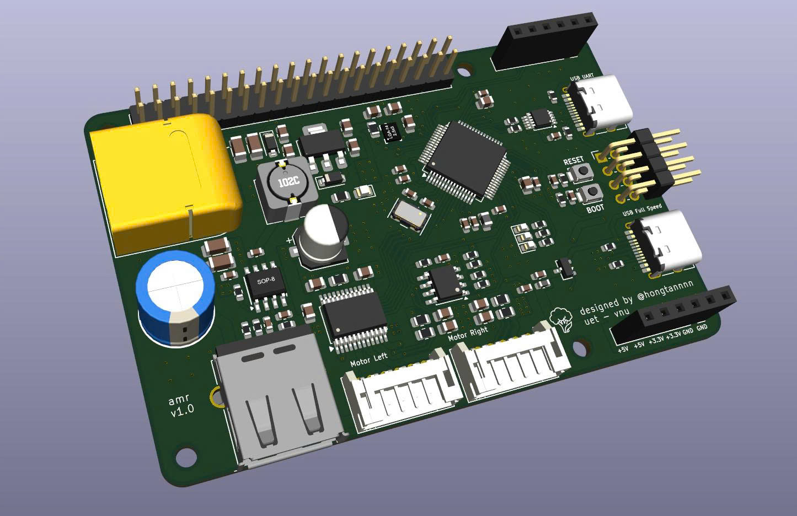

# AMR Hardware & PCB Design (amr_stm32)

A low-level controller board and hardware system designed as the foundation for an Autonomous Mobile Robot (AMR). The project focuses on real-time task processing, sensor communication, and motor control in preparation for future integration with ROS 2, SLAM algorithms, and autonomous navigation.

## 📸 3D Render

*Completed PCB design featuring peripheral connectors, power supply block, and central microcontroller.*

## 🚀 Hardware Features

*   **Central Microcontroller (MCU):** Utilizes the **STM32F405RGT6** chip, providing powerful processing capabilities for PID algorithms, high-speed encoder reading, and peripheral communication.
*   **Industrial-grade Design:** 4-layer layout with dedicated GND and Power (VCC) planes, ensuring Signal Integrity and Electromagnetic Interference (EMI) reduction when operating in environments with electrical motors.
*   **Communication & Peripherals:** 
    *   USB Type-C/Micro port for flashing code and debugging.
    *   Standard headers (2.54mm) for I2C, SPI, and UART expansion to communicate with a Raspberry Pi / Jetson Nano or IMU/LiDAR sensors.
    *   JST jacks and Terminal Blocks for safe power supply and motor control connections.
*   **Power Circuit:** Integrated voltage regulator block, high-capacity filter capacitors, and protection circuits, ensuring stable voltage for the MCU and logic modules.

## 🛠 Tools & Software

*   **Hardware Design (EDA):** KiCad
*   **Embedded Programming:** STM32CubeIDE / STM32CubeMX
*   **Mechanical Design (CAD):** Autodesk Fusion 360

## 🎯 Future Roadmap

- [ ] Complete basic Firmware: Read encoders, control DC/BLDC motors via PID.
- [ ] Establish stable UART/I2C communication protocols between the STM32 and embedded computers (Raspberry Pi/Mini PC).
- [ ] Integrate the microcontroller package into the **ROS 2** network (using micro-ROS or rosserial).
- [ ] Deploy LiDAR and IMU sensors for mapping (SLAM) and navigation.

---
**Author:** Truong Hong Tan (@hongtannnn)  
*Student at the University of Engineering and Technology (UET) - Vietnam National University, Hanoi.*
